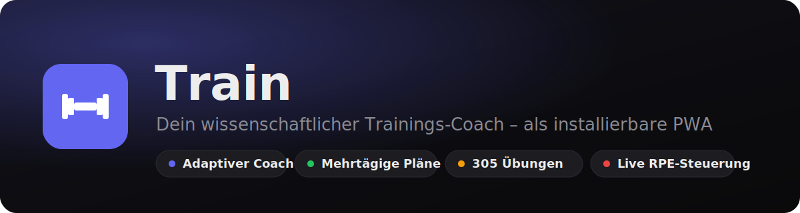
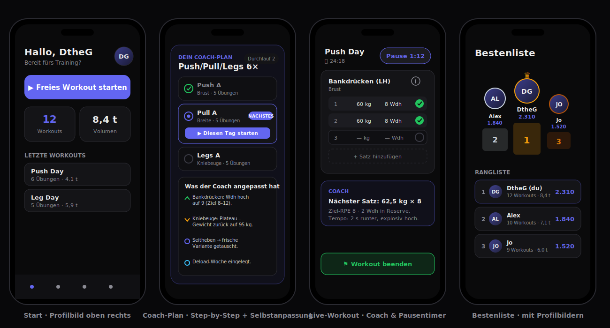
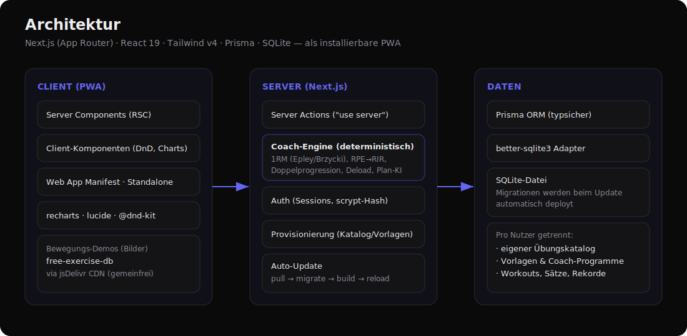
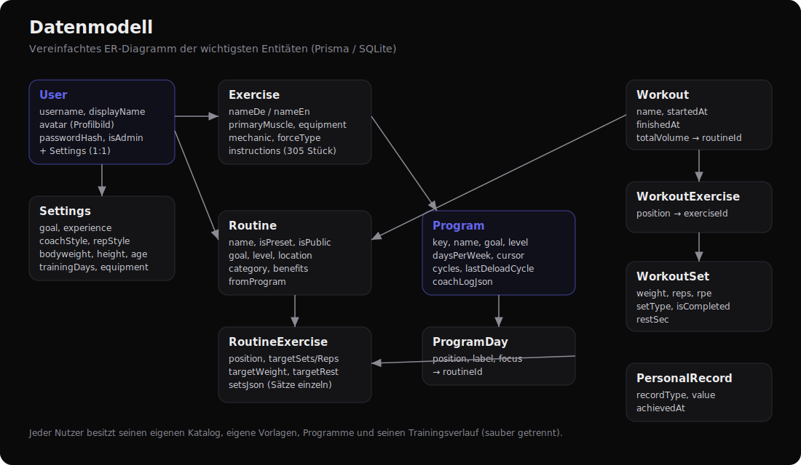

<p align="center">
  
</p>

<p align="center">
  
  
  
  
  
  
  
</p>

# Train — dein Trainings-Coach

**Train** ist eine installierbare Web-App (PWA) zum detaillierten Live-Tracking deines Krafttrainings — mit einem **adaptiven Coach**, der dich Satz für Satz steuert, mehrtägige Trainingspläne erstellt und sie auf Basis deiner echten Daten **automatisch weiterentwickelt**. Alle Empfehlungen sind **deterministische Sportwissenschaft** (geschätztes 1RM, RPE/RIR, Doppelprogression, Deload) — kein externes Sprachmodell, dadurch sofort, offline-fähig und reproduzierbar.

> Die App ist durchgehend auf Deutsch, mobil-first und als Startbildschirm-App (iOS/Android) nutzbar.

<p align="center">
  
</p>

---

## Inhalt

- [Highlights](#highlights)
- [Features im Detail](#features-im-detail)
  - [Der Coach (live im Satz)](#-der-coach-live-im-satz)
  - [Coach-Pläne: mehrtägig & selbstanpassend](#-coach-pläne-mehrtägig--selbstanpassend)
  - [Vorlagen-Katalog mit Filter](#-vorlagen-katalog-mit-filter)
  - [Plan-Editor](#-plan-editor)
  - [Übungs-Datenbank & Bewegungs-Demos](#-übungs-datenbank--bewegungs-demos)
  - [Live-Workout](#-live-workout)
  - [Statistik & Muskel-Map](#-statistik--muskel-map)
  - [Verlauf & Kalender](#-verlauf--kalender)
  - [Bestenliste](#-bestenliste)
  - [Profil, Coach-Konfiguration & Profilbild](#-profil-coach-konfiguration--profilbild)
  - [Trainingswissen](#-trainingswissen)
  - [Admin & Auto-Update](#-admin--auto-update)
- [Architektur](#architektur)
- [Datenmodell](#datenmodell)
- [Tech-Stack](#tech-stack)
- [Schnellstart](#schnellstart)
- [Projektstruktur](#projektstruktur)
- [Die Wissenschaft hinter dem Coach](#die-wissenschaft-hinter-dem-coach)
- [Lizenzen & Credits](#lizenzen--credits)

---

## Highlights

| | |
|---|---|
| 🤖 **Adaptiver Coach** | Empfiehlt live Gewicht & Wiederholungen je Satz, RPE-bewusst, mit Aufwärm-Rampe und Tempo-Hinweis. |
| 🗓️ **Mehrtägige Pläne** | 6 wissenschaftlich aufgebaute Programme (Ganzkörper, Upper/Lower, PPL, 5×5, Zuhause, Definition) — Tag für Tag. |
| ♻️ **Selbstanpassung** | Nach jedem Workout: steigern, halten, entlasten oder Übung tauschen — plus automatische Deload-Wochen. |
| 📚 **305 Übungen** | Voller Katalog mit Bewegungs-Demos, Anleitung, Muskel- & Equipment-Zuordnung. |
| 🧩 **14 Vorlagen** | Filterbar nach Ziel, Ort (Studio/Zuhause) und Level, je mit Beschreibung „wofür gut". |
| ✋ **Komfort-Editor** | Drag-and-drop, einzelne Sätze pro Übung, Übungs-Tausch, „Mit Coach verbessern". |
| 📊 **Statistik** | Muskelgruppen-Radar, Trends, pro Workout eine Qualitäts-Muskelkarte (rot/gelb/grün). |
| 🏆 **Bestenliste** | Fairer Score aus Konsistenz, Volumen, Stärke & Fortschritt — mit Profilbildern. |
| 📱 **PWA** | Installierbar, dunkles Design, Safe-Area-Support, „add to home screen". |

---

## Features im Detail

### 🤖 Der Coach (live im Satz)

Im laufenden Workout berechnet der Coach für **jeden Satz** eine konkrete Empfehlung:

- **Gewicht & Wiederholungen** aus deinem geschätzten 1RM (Mittel aus Epley & Brzycki, bei >12 Wdh gedeckelt), abgestimmt auf dein **Ziel** (Kraft 3–6, Hypertrophie 8–12, Kraftausdauer 14–20).
- **RPE/RIR-bewusst**: Trägst du den RPE ein, steuert der Coach Last und Pausen spürbar genauer (RPE 8 ≈ 2 Wiederholungen in Reserve).
- **Aufwärm-Rampe** vor dem ersten Arbeitssatz — aber nie bei Körpergewichtsübungen (das wäre unlogisch).
- **Tempo-Hinweis** und **Pausen-Empfehlung** je nach Ziel.
- **Live-Reaktion** nach jedem abgehakten Satz („stark — leg beim nächsten Satz nach" / „das war grenzwertig, halte das Gewicht").
- **Coach-Stil** wählbar: *vorsichtig*, *ausgewogen*, *aggressiv* — verändert Sprünge und wie hart gepusht wird.

### 🗓️ Coach-Pläne: mehrtägig & selbstanpassend

Der Coach stellt dir einen **kompletten Trainingsplan über mehrere Tage** zusammen, den du der Reihe nach abarbeitest:

- **6 kuratierte Programme**: Ganzkörper 3× (Einstieg), Upper/Lower 4×, Push/Pull/Legs 6×, Kraft 3× (5×5), Zuhause 3× (ohne Geräte), Definition & Kondition 4×.
- **Empfehlung nach Profil**: passend zu Ziel, Level, Trainingstagen und verfügbarem Equipment — mit Begründung. Fehlen wichtige Angaben, **fragt der Coach danach** und verweist ins Profil, damit der Plan sicher und logisch ist.
- **Visuelle Übersicht** mit Tages-Stepper: ✅ erledigt · 🔵 „Als Nächstes" (mit Start-Knopf) · ⚪ offen, plus Durchlauf-Zähler.
- **Echte Selbstanpassung** nach jedem Plan-Workout (pro Übung, anhand von Gewicht/Wdh/RPE):
  - **Doppelprogression** — erst Wiederholungen in der Zielspanne hochfahren, dann Last erhöhen.
  - **Halten** bei zu hohem RPE trotz erreichter Wiederholungen (Ermüdung steuern).
  - **Entlasten** bei verfehlten Wiederholungen mit rückläufigem Trend.
  - **Tauschen** bei hartnäckigem Plateau (Isolationsübung → frische Variante; Grundübung → leichter Deload).
  - **Automatische Deload-Woche**, wenn viele Übungen Ermüdung zeigen oder seit 6 Durchläufen keine Pause war.
- **Transparenz**: Jede automatische Änderung wird mit Begründung protokolliert und unter „**Was der Coach angepasst hat**" angezeigt.

### 🧩 Vorlagen-Katalog mit Filter

14 anerkannte **Einzel-Trainings** für jede Trainingsart, **filterbar** per Suche und Chips:

- **Ziel**: Kraft · Muskelaufbau · Kraftausdauer · Allgemein
- **Ort**: Studio · Zuhause · beides
- **Level**: Anfänger · Fortgeschritten · Erfahren

Jede Vorlage hat eine **Beschreibung, was und wofür** trainiert wird (z. B. „Alle Druck-Muskeln an einem Tag … hohes Wochenvolumen bei guter Erholung"). Beispiele: Ganzkörper-Basis, Kraft-Ganzkörper 5×5, Push/Pull/Leg Day, Upper/Lower, Bro-Split, Ganzkörper Zuhause, Oberkörper mit Kurzhanteln, Core & Bauch, HIIT/Kondition.

### ✋ Plan-Editor

Der Editor jeder Vorlage/Routine bietet:

- **Drag-and-drop** zum Umsortieren (sanft animiert, mit Einrast-Punkten; Touch + Maus + Tastatur, dank `@dnd-kit`).
- **Einzelne Sätze pro Übung** — z. B. Satz 1: 30 kg × 10, Satz 2: 35 kg × 8 (mit Fallback auf einheitliche Sätze).
- **Übung austauschen** an gleicher Stelle (Sätze & Pause bleiben erhalten).
- **„Mit Coach verbessern"** — ordnet Grundübungen nach vorn und ergänzt fehlende Gegenspieler (Druck/Zug-Balance).
- **Info-Icon je Übung** — öffnet direkt im Plan die **Bewegungs-Demo (Video) & Anleitung**, ohne die Seite zu verlassen.

### 🏋️ Übungs-Datenbank & Bewegungs-Demos

- **305 Übungen** mit deutscher/englischer Bezeichnung, Hauptmuskel, Equipment, Mechanik (Grund-/Isolationsübung) und Ausführungstext.
- **Bewegungs-Demos**: zwei Posen (Start/Ende), die weich ineinander überblenden — Bilder vom gemeinfreien `free-exercise-db` (Unlicense) über CDN. Übungen mit Demo tragen ein Video-Symbol.
- **Detaillierte Muskelkarte** auf Basis von Open-Source-Anatomiedaten (vorne/hinten, primär & sekundär hervorgehoben).
- Eigene Übungen lassen sich anlegen.

### ⏱️ Live-Workout

- Pro Übung **Satz-Tabelle** mit Gewicht, Wiederholungen, RPE und Set-Typ (Aufwärmen/Normal/Dropset/Failure).
- **Pausentimer** mit Coach-Empfehlung.
- **Wischgeste** zum Löschen einzelner Sätze (flüssig animiert), animiertes Hinzufügen von Sätzen/Übungen.
- **Info-Vorschau** je Übung direkt im Workout (Demo + Anleitung), ohne das Training zu verlassen.
- **Abschluss-Overlay**, das offen bleibt, bis du es schließt: Workout benennen, Coach-Fazit, eingefrorene Trainingsdauer, Konfetti — und auf Wunsch die erreichten Werte **satzgenau in die Vorlage übernehmen**.

### 📊 Statistik & Muskel-Map

- **Muskelgruppen-Radar** über dein Trainingsvolumen.
- **Trends** der wichtigsten Übungen (geschätztes 1RM über die Zeit).
- **Pro Workout** eine **Qualitäts-Muskelkarte**: trainierte Muskeln werden rot/gelb/grün eingefärbt (nur die tatsächlich trainierten).

### 📅 Verlauf & Kalender

- Trainingskalender mit allen Einheiten.
- Verlauf je Workout inkl. aller Sätze; einzelne Workouts löschbar (verschwinden korrekt aus den Statistiken).

### 🏆 Bestenliste

Fairer Vergleich **aller Nutzer** über einen zusammengesetzten Score:

- **Konsistenz** (Workouts), **Volumen** (kg), **Stärke** (bestes geschätztes 1RM) und **Fortschritt** (Aufwärtstrend je Übung).
- Klassisches **Podium** (Top 3) + vollständige Rangliste mit **aufklappbarer Punkte-Aufschlüsselung** — alles mit **Profilbildern**.

### 👤 Profil, Coach-Konfiguration & Profilbild

- **Coach-Profil**: Ziel, Erfahrung, Coach-Stil, Wiederholungs-Stil, Trainingstage/Woche, Geschlecht, Alter, Körpergewicht, Größe, Einschränkungen/Verletzungen, verfügbares Equipment.
- **Personalisierte Coach-Tipps** aus deinem Profil.
- **Profilbild hochladen**: wird clientseitig auf ein kleines Quadrat (256 px) skaliert und erscheint **oben rechts auf der Startseite**, in der Navigation und in der **Bestenliste** — mit sauberem Initialen-Fallback.

### 📖 Trainingswissen

Eine ausführliche **Wissensdatenbank** des Coaches: Volumen, Wiederholungen, Pausen, Progression, Erholung, Ernährung & mehr — als Nachschlagewerk verlinkt im Profil.

### 🛠️ Admin & Auto-Update

- **Benutzerverwaltung** für Admins (anlegen/löschen, eigener Inhalt pro Nutzer).
- **Auto-Update**: Ein Skript zieht neue Commits, führt Migrationen aus, baut neu und lädt den Server neu. Admins können das Update bei Bedarf **manuell anstoßen** (mit Live-Fortschritt), wenn eine neuere Version verfügbar ist.

---

## Architektur

<p align="center">
  
</p>

- **Client (PWA)**: Next.js App Router mit React Server Components + gezielten Client-Komponenten (Drag-and-drop, Charts). Bewegungs-Demos werden zur Laufzeit vom CDN geladen.
- **Server**: Server Actions kapseln alle Schreibvorgänge; die **Coach-Engine** ist reine, deterministische TypeScript-Logik. Auth über DB-Sessions (scrypt-Hash).
- **Daten**: Prisma + SQLite (better-sqlite3). Migrationen werden beim Update automatisch deployt. **Pro Nutzer** sind Katalog, Vorlagen, Programme und Verlauf sauber getrennt.

## Datenmodell

<p align="center">
  
</p>

---

## Tech-Stack

| Bereich | Technologie |
|---|---|
| Framework | **Next.js 16** (App Router, Server Actions, RSC) |
| UI | **React 19**, **Tailwind CSS v4**, lucide-react, recharts |
| Interaktion | **@dnd-kit** (Drag-and-drop), eigene Gesten/Animationen |
| Daten | **Prisma 7** + **SQLite** (better-sqlite3-Adapter) |
| Sprache | **TypeScript 5** |
| Coach | Reine TS-Sportwissenschaft (kein LLM) |
| Demos | `free-exercise-db` (gemeinfrei) · Anatomie aus Open-Source-Daten |

---

## Schnellstart

> Voraussetzungen: Node.js 20+ und npm.

```bash
# 1) Abhängigkeiten installieren
npm install

# 2) Datenbank vorbereiten (.env mit DATABASE_URL anlegen)
echo 'DATABASE_URL="file:./dev.db"' > .env
npx prisma migrate deploy      # Schema/Migrationen anwenden
npx prisma generate            # Prisma-Client erzeugen
npm run db:seed                # Stammdaten, Katalog, Vorlagen, Admin

# 3) Entwicklung starten
npm run dev
```

App öffnen: **http://localhost:3000**

**Standard-Login** (beim ersten Seed angelegt):

| Benutzer | Passwort |
|---|---|
| `admin` | `train1234` |

> Passwort nach dem ersten Login ändern. Über `ADMIN_USERNAME` / `ADMIN_PASSWORD` (Umgebungsvariablen) lässt sich der Start-Account anpassen.

### npm-Skripte

| Skript | Zweck |
|---|---|
| `npm run dev` | Entwicklungsserver |
| `npm run build` | Produktions-Build |
| `npm run start` | Produktionsserver |
| `npm run lint` | ESLint |
| `npm run db:seed` | Datenbank befüllen (idempotent) |
| `npm run db:studio` | Prisma Studio |
| `npm run db:migrate` | Migration (Entwicklung) |

### Produktion & Auto-Update

Im Ordner `scripts/` liegen Helfer für ein selbst gehostetes Setup: `deploy.sh`, `setup-nginx.sh`, `install-autoupdate.sh` und `auto-update.sh` (pull → `prisma migrate deploy` → `db:seed` → build → reload). Der Admin-Bereich kann ein Update bei verfügbarer neuer Version manuell auslösen.

---

## Projektstruktur

```
src/
├─ app/                    # Routen (App Router)
│  ├─ page.tsx             # Start (mit Profilbild oben rechts)
│  ├─ routines/            # Pläne: Katalog, Coach-Pläne, Editor
│  ├─ workout/[id]/        # Live-Workout
│  ├─ exercises/           # Übungs-Datenbank & Detail
│  ├─ stats/ analysis/     # Statistik & Coach-Analyse
│  ├─ calendar/ history/   # Kalender & Verlauf
│  ├─ leaderboard/         # Bestenliste
│  ├─ profile/ wissen/     # Profil/Coach-Config & Wissensdatenbank
│  └─ admin/               # Benutzerverwaltung & Update
├─ components/             # UI-Komponenten (Editor, Coach-Card, Muscle-Map, …)
├─ lib/
│  ├─ coach.ts             # Coach-Kern (1RM, RPE, Empfehlung, Score)
│  ├─ coach-program.ts     # Selbstanpassung der Programme
│  ├─ coach-knowledge.ts   # Wissensdatenbank & Plan-Check
│  ├─ program-data.ts      # Kuratierte mehrtägige Programme
│  ├─ seed-data.ts         # 305 Übungen + 14 Vorlagen
│  ├─ actions.ts           # Server Actions
│  └─ provision.ts         # Pro-Nutzer-Provisionierung
├─ proxy.ts                # Middleware (Auth-Gate)
└─ generated/prisma/       # Prisma-Client
prisma/
├─ schema.prisma
└─ migrations/
docs/                      # Diagramme & Mockups (dieses README)
```

---

## Die Wissenschaft hinter dem Coach

Der Coach ist **deterministisch** — gleiche Eingaben ergeben gleiche, nachvollziehbare Empfehlungen (kein Zufall, kein externes Modell):

- **1RM-Schätzung**: Mittel aus **Epley** und **Brzycki**, Wiederholungen bei 12 gedeckelt (höhere Wdh überschätzen das Maximum).
- **RPE → RIR**: RPE 10 = Versagen (0 in Reserve), RPE 8 ≈ 2 in Reserve; halbe Stufen erlaubt. Ein nicht bis zum Versagen geführter Satz hat Reserve — das echte Maximum liegt höher.
- **Doppelprogression**: Erst die Wiederholungen in der Zielspanne aufbauen, dann die Last erhöhen und die Wiederholungen zurücksetzen.
- **Verlaufsanalyse**: lineare Regression der 1RM-Schätzungen erkennt *steigend / flach / stagnierend / rückläufig* und empfiehlt bei hartnäckigem Plateau eine Entlastung.
- **Last-Schritte**: realistische Hantelscheiben-Sprünge je Gewichtsbereich, zusätzlich gedämpft durch Alters- und Stil-Modifikatoren.
- **Volumen-Richtwerte**: wöchentliche Satz-Spannen je Muskelgruppe; Plan-Check warnt vor zu wenig/zu viel Volumen und Dysbalancen.

> **Hinweis:** Train ersetzt keine medizinische oder physiotherapeutische Beratung. Die Empfehlungen sind sportwissenschaftliche Orientierung, keine starre Vorschrift — höre auf deinen Körper.

---

## Lizenzen & Credits

- **Bewegungs-Demos**: [`free-exercise-db`](https://github.com/yuhonas/free-exercise-db) — **Unlicense** (gemeinfrei), via jsDelivr-CDN.
- **Anatomie-/Muskeldaten**: aus einem **MIT**-lizenzierten Open-Source-Datensatz (Body-Highlighter).
- **Icons**: [lucide](https://lucide.dev) (ISC).
- **Charts**: [recharts](https://recharts.org) (MIT).

Die Abbildungen in diesem README (`docs/*.svg`) sind schematische Mockups/Diagramme der App-Oberfläche.
